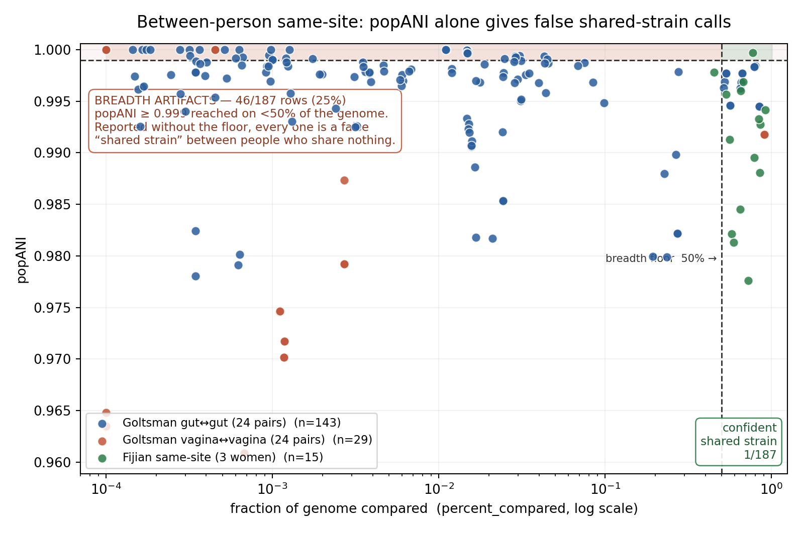

# The between-person null — and why the breadth floor is load-bearing

*A Study D (methods) result. Between-person, **same-site** strain comparisons: 48 pairs across the
Goltsman/DiGiulio cohort (PRJNA288562, 4 unrelated US women — 24 gut↔gut + 24 vagina↔vagina), plus
the Fijian pilot (PRJNA826539, 3 women). Data in [`../example/between_person_null/`](../example/between_person_null)
and [`../example/fijian/`](../example/fijian); figure `../example/figures/fig_breadth_floor.png`.*

## The gap this fills

Every strain-sharing claim needs a null: *what popANI do people who share nothing produce?*
The pilot's original null ([`04b_between_person_compare.sh`](../scripts/04b_between_person_compare.sh))
compared **gut↔vagina** pairs only. That leaves the question the rectovaginal study actually
depends on — do unrelated people share strains **at the same site**? — untested.

That gap had a concrete cost. It let a between-woman *P. vulgatus* call in the Fijian pilot be
misread as a generalist taxon, when the control that would have settled it did not exist
(see [`fijian-pilot-findings.md`](./fijian-pilot-findings.md)).

## Result 1 — the null is clean: zero shared strains in 48 pairs

| | pairs | rows | with a value | evaluable (pc ≥ 0.5) | **shared strains** |
|---|--:|--:|--:|--:|--:|
| gut ↔ gut | 24 | 186 | 143 | 16 | **0** |
| vagina ↔ vagina | 24 | 122 | 29 | 4 | **0** |
| **total** | **48** | **308** | **172** | **20** | **0** |

Unrelated people in this cohort share no strains at either site. The one genuine between-person
shared strain anywhere in this work remains the Fijian *P. vulgatus* pair (below).

The **vagina↔vagina null is entirely new** — nothing had tested whether unrelated women share
vaginal strains. They do not, though with only 4 evaluable comparisons this is a weak negative
rather than a strong one.

## Result 2 — popANI without a breadth floor has a 27% false-positive rate

Of the 172 comparisons that produced a value, **46 (27%) reach popANI ≥ 0.999** — the same-strain
threshold — **while comparing less than 50% of the genome.** All 46 are artifacts. **27 of them
report popANI of exactly 1.00000**, at `percent_compared` between 0.00000 and 0.045.

| | valued rows | popANI ≥ 0.999 | artifacts | rate |
|---|--:|--:|--:|--:|
| gut ↔ gut | 143 | 35 | 35 | **24%** |
| vagina ↔ vagina | 29 | 11 | 11 | **38%** |
| combined | 172 | 46 | 46 | **27%** |

Ranked naively by popANI, these artifacts are the *top hits in the dataset* — they outrank every
real comparison. Report popANI alone and 27 perfect strain-sharing events between people who have
never met go into the results.



## Result 3 — the artifacts concentrate in a predictable place

| genome | artifact rows |
|---|--:|
| *L. crispatus* | 15 |
| *L. jensenii* | 10 |
| *F. prausnitzii* | 7 |
| *P. bivia* | 6 |
| *L. iners* | 4 |
| *G. vaginalis* | 3 |
| *B. fragilis* | 1 |

**32 of 46 artifacts (70%) are vaginal *Lactobacillus* or *Gardnerella*** — genomes that are largely
*absent* from the sample being profiled. A genome that is not really there still attracts a trickle
of spurious mappings, and a handful of concordant bases produces popANI 1.0. The organisms most
likely to generate false sharing are the ones least likely to be present.

This has a reference-design consequence: **a broad reference raises sensitivity and manufactures
artifacts at the same time.** Both effects scale with catalogue breadth, so widening the reference
without enforcing the floor makes results worse, not better.

## Result 4 — the false-positive rate is cohort-dependent, and worst where data are thin

- **Goltsman:** only 20/172 valued rows (12%) clear the breadth floor at all; 27% are artifacts.
- **Fijian:** 14/15 rows (93%) clear the floor; **zero** artifacts.

The difference is depth relative to the reference, not biology. Fijian profiles are deep against a
narrow community; Goltsman profiles are shallower against a reference containing genomes that barely
map. **The floor matters most precisely where the data are weakest — which is where the temptation
to relax it is strongest.** The rate is therefore a property of a cohort's depth and reference, and
cannot be cited from another study.

## Result 5 — one genuine between-person shared strain

The single call that survives both criteria across all 187 comparisons is the Fijian *P. vulgatus*
pair (107R ↔ 57R, popANI 0.99971 at 77% breadth). It is not a breadth artifact, not a generalist
taxon, and not contamination — the full elimination is in
[`fijian-pilot-findings.md`](./fijian-pilot-findings.md). Two unrelated women in one community
genuinely share a gut strain, and the 48-pair US null above is what makes that call interpretable:
against a background of zero, it stands out.

## What this means for the standard

1. **`popani_primary` and `breadth_min` are a pair, not a primary criterion plus a nicety.**
   Reporting either alone is not a weaker version of the standard; on this data it is wrong 27% of
   the time. The versioned standard already encodes both — this quantifies the cost of dropping one.
2. **Every cohort needs its own same-site between-person null.** The rate is a property of the
   cohort's depth and reference, not a universal constant.
3. **Rank candidate calls by breadth, never by popANI.** A popANI-sorted table puts the artifacts on
   top — all 27 of the perfect scores here are noise.
4. **Report the evaluable fraction.** Only 12% of Goltsman rows could be assessed at all. A null of
   "zero shared strains" means little without saying how many comparisons were even possible.

## Reproducing

```bash
# the same-site between-person null (both body sites, N profiles per subject; resumable per pair)
N_PER_SUBJECT=2 python scripts/dev/_between_person_null.py

# the targeted P. vulgatus cross-cohort test
python scripts/dev/_pvulgatus_between.py

# the figure
python scripts/plot_breadth_floor.py \
  --inputs "example/between_person_null/gut.tsv:Goltsman gut↔gut (24 pairs)" \
           "example/between_person_null/vagina.tsv:Goltsman vagina↔vagina (24 pairs)" \
           "example/fijian/genomeWide_compare.tsv:Fijian same-site (3 women)" \
  --out example/figures/fig_breadth_floor.png
```

Rows where `popANI == 0` mean inStrain emitted a record but compared nothing usable. They are
excluded from the denominators above — counting them would flatter the artifact rate rather than
report it honestly. 136 of the 308 rows are of that kind, which is itself a measure of how much of a
broad reference is simply not present in any given sample.
